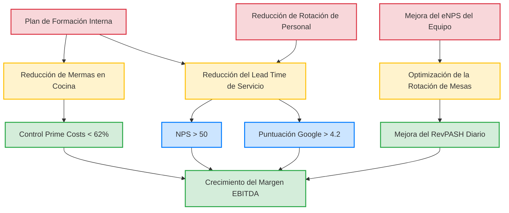

# 4. Alineación Estratégica y Selección de KPIs

Este capítulo da la respuesta cuantitativa a los problemas detectados en el CAME. Antes de construir el panel, hay que resolver una pregunta concreta: ¿qué números determinan realmente si una franquicia sobrevive a final de mes? No todos los indicadores valen lo mismo. El objetivo es identificar los que sí importan, justificarlos y articularlos en un catálogo de KPIs que después se programa en el sistema.

## 4.1 Selección de los Vectores Críticos de Rentabilidad en Hostelería

De entre todas las métricas que ofrece la contabilidad de gestión, no podemos limitar el control de un restaurante a uno o dos datos aislados. La literatura especializada en restauración organizada identifica tres grandes vectores macro como los pilares de supervivencia de los que colgará, posteriormente, todo nuestro catálogo de KPIs diarios:

*   Los Costes Directos Operativos (Prime Costs): Es el indicador macro de margen más importante para los hosteleros [Ninemeier y Hayes, 2006]. Es la suma del Gasto en Producto (Food & Beverage Cost) y el Gasto en Personal (Labor Cost). La literatura académica y los estándares de la industria establecen de forma categórica que si la suma de ambos factores supera el umbral del 62% sobre la facturación bruta, el establecimiento entra en pérdidas operativas. Este límite empírico estricto del 62% fue establecido por Dopson y Hayes (2015) en su tratado *Food and Beverage Cost Control*, demostrando matemáticamente que sobrepasar esta cifra impide generar suficiente margen bruto para cubrir la estructura rígida de costes fijos (alquileres, suministros, impuestos y amortizaciones).
*   La Eficiencia Operativa (RevPASH): Medir únicamente el ticket medio resulta académicamente insuficiente, ya que un grupo que gasta 20 euros pero ocupa una mesa durante casi tres horas reduce críticamente la rentabilidad por asiento disponible. Para corregir este fallo del sistema tradicional, se impone el uso del RevPASH (Revenue Per Available Seat Hour), una métrica desarrollada por la Universidad de Cornell, pionera en Revenue Management [Kimes, 1989]. Este indicador cruza de forma avanzada el gasto por comensal con el tiempo exacto de ocupación, fomentando una rotación óptima.
*   La Lealtad (NPS): Orientar la inversión exclusivamente a captar clientes nuevos resulta más inestable económicamente que fidelizar al residente local. Para medir esto, se utilizará el sistema Net Promoter Score (NPS) elaborado por Fred Reichheld [Reichheld, 2003]. La fortaleza estratégica de este indicador radica en que descarta a los clientes pasivos (puntuaciones 7-8) y contabiliza exclusivamente a los "promotores leales" (puntuaciones 9-10).

La elección de estos tres vectores no es arbitraria. Los informes internos de gerencia y los cierres contables de 2024 de Claunafood (cuya metodología de cálculo se detalla en el apartado 4.4) confirman que son exactamente las tres áreas donde la empresa sangra. El Prime Cost combinado se situó en torno al 65%, tres puntos por encima del límite del 62% de Dopson y Hayes. El NPS arrojó 65 puntos, lejos del umbral de excelencia de +75. Los números confirman la teoría.

## 4.2 Selección y elaboración del catálogo de KPIs

Un catálogo de KPIs es el conjunto de métricas operativas que alimentan los tres vectores anteriores. Según Kaplan y Norton [1996], su construcción parte de una traducción directa: los objetivos del CAME se convierten en variables cuantificables en el día a día. El vínculo es el siguiente:

- El NPS (Lealtad) se alimenta de los KPIs de la Perspectiva del Cliente (NPS Global, Delivery, Incidencias, Recurrencia).
- El RevPASH (Eficiencia) se nutre de los KPIs de Procesos Internos (Lead Time, Rotación de Mesas, Escandallo).
- El Prime Cost (Márgenes) se controla mediante los KPIs Financieros y de Aprendizaje (Food Cost, Labor Cost, EBITDA, Formación, Rotación de plantilla).

Se han seleccionado estas 12 métricas y no otras porque atacan directamente las tres vulnerabilidades del DAFO: rotación de personal, lentitud en picos de demanda y descuadres de mermas. A continuación, la ficha técnica de cada una:

Tabla 4.1. Catálogo Técnico de KPIs (Perspectivas de Aprendizaje y Procesos)

| Perspectiva | KPI (¿Qué es?) | Método de Cálculo (¿Cómo se elabora?) |
| :--- | :--- | :--- |
| **Aprendizaje** | **Tasa de Rotación** | `(Bajas mensuales / Plantilla media activa) * 100` |
| **Aprendizaje** | **Índice de Formación** | `(Horas formación completadas / Horas objetivo exigidas) * 100` |
| **Aprendizaje** | **eNPS (Employee Net Promoter Score) (Clima Laboral)** | `Encuesta interna anónima mensual (Escala de 1 a 10)` |
| **Procesos** | **Rotación de Mesas** | `Total tickets servicio / Número total de mesas físicas del local` |
| **Procesos** | **Lead Time de Cocina** | `Marca de tiempo "Plato servido" - Marca de tiempo "Envío a cocina en TPV"` |
| **Procesos** | **Desviación Escandallo** | `(Coste real inventariado - Coste teórico por ficha técnica) / Coste teórico` |

Tabla 4.2. Catálogo Técnico de KPIs (Perspectivas de Cliente y Financiera)

| Perspectiva | KPI (¿Qué es?) | Método de Cálculo (¿Cómo se elabora?) |
| :--- | :--- | :--- |
| **Cliente** | **NPS Global** | `% Clientes Promotores (9-10) - % Clientes Detractores (1-6)` |
| **Cliente** | **% Ventas Delivery** | `(Ingresos brutos plataformas delivery / Ingresos brutos totales) * 100` |
| **Cliente** | **Tasa de Incidencias** | `(Número de devoluciones o quejas formales / Total tickets emitidos) * 100` |
| **Financiera** | **EBITDA Margin** | `(Beneficio operativo antes de intereses, impuestos y amortización / Ventas) * 100` |
| **Financiera** | **Prime Cost (F&B + Labor)** | `((Coste materia prima + Coste personal) / Ventas) * 100` |
| **Financiera** | **RevPASH (Revenue Per Available Seat Hour)** | `Ingresos del período / (Asientos disponibles * Horas de servicio del local)` |

## 4.3 El Mapa Estratégico (Relaciones de Causa-Efecto)

Poner los KPIs en tablas sin conectarlos entre sí los convierte en datos sueltos. El Mapa Estratégico existe para mostrar exactamente esas conexiones. ¿Para qué sirve? Para que la gerencia pueda verificar si la mejora en la base del equipo acaba impactando —meses después— en el EBITDA. No es un esquema decorativo: es la representación gráfica de las hipótesis causa-efecto del negocio.

El mapa de Claunafood conecta los indicadores inductores de la base con los tres vectores críticos —Prime Cost, RevPASH y NPS— que convergen en el crecimiento del EBITDA:

Figura 4.1. Mapa Estratégico de Claunafood S.L. Fuente: Elaboración propia a partir de Kaplan y Norton, 2004.

**Cadena de relaciones de causa-efecto (Justificación del Mapa):**

1.  **La inducción hacia el control del Prime Cost:** Si se retiene al personal de sala y se eleva su curva de aprendizaje (Perspectiva Base), se disminuyen drásticamente los errores operativos en cadena (Perspectiva de Procesos). Esta reducción de fallos humanos frena matemáticamente el exceso de consumo de materia prima (mermas), estabilizando la desviación del escandallo. El efecto final (lagging) se manifiesta al blindar la suma salarial y material por debajo del límite empírico del 62% del Prime Cost (Financiera).
2.  **El impulso causal del RevPASH y el NPS:** Cuando la plantilla opera respaldada por un eNPS elevado (Base), la tracción operativa minimiza los bloqueos de cocina, reduciendo significativamente el Lead Time de servicio (Procesos). Entregar los pedidos con mayor velocidad acelera directamente la rotación física de las sillas, disparando el RevPASH diario (Financiera). Paralelamente, la percepción externa de eficiencia catapulta el indicador de lealtad NPS de los clientes, asegurando la facturación futura (Financiera) mediante la recurrencia sistemática del segmento local.

## 4.4 Metodología de extracción y cálculo de resultados base

Tal y como exige el rigor de todo diseño de control de gestión, los porcentajes y resultados finales expuestos en los Capítulos 3 y 4 (como el 65% de Prime Cost acumulado o el NPS de 65 puntos) no son suposiciones teóricas, sino extracciones directas de la actividad real de la empresa familiar. 

Para llegar a ellos, se ha empleado una metodología de recolección de datos primarios retrospectivos:
*   **Costes directos y facturación:** Se exportaron y procesaron los archivos `.csv` en bruto de las cajas registradoras (TPV Ágora) de Ditaly y La Mafia correspondientes a todos los turnos del Q3 y Q4 de 2024. Posteriormente, estas cifras de venta bruta se cruzaron manualmente en hojas de cálculo con el sumatorio de nóminas y las facturas de proveedores homologados (albaranes de compra de alimentación) facilitados por la gerencia para obtener el *Food Cost* y el *Labor Cost* real de la empresa antes de iniciar este TFG.
*   **Datos de cliente y lealtad:** Para determinar el NPS base y las tasas de incidencias, se extrajeron los registros automatizados de quejas y las puntuaciones consolidadas del sistema de reservas "El Tenedor" (TheFork) y las reseñas validadas en Google My Business correspondientes al mismo semestre, aplicando la fórmula estándar de detractores contra promotores.
