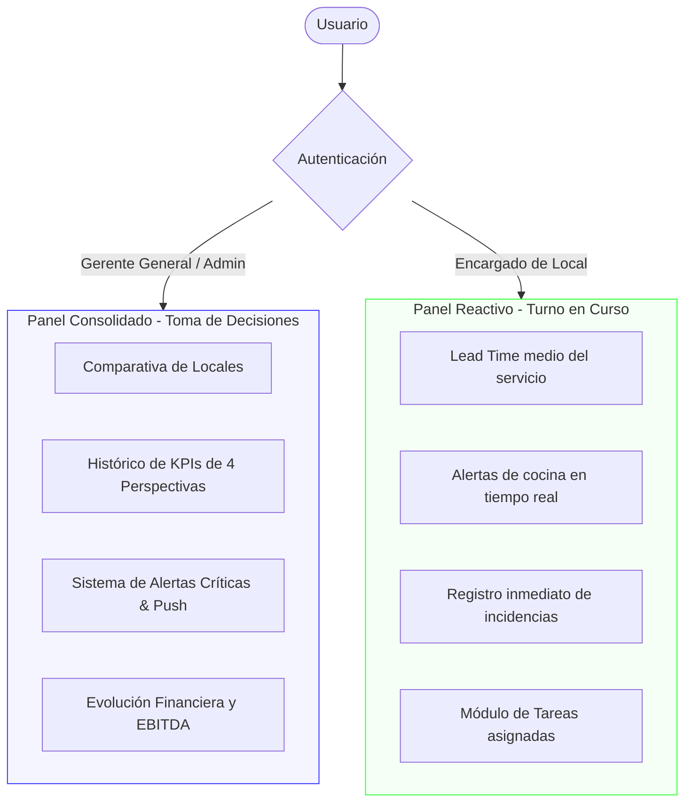

# 5. Diseño Aplicado del Cuadro de Mando para Claunafood S.L.

Con los indicadores ya justificados, este capítulo baja al detalle: cómo se aplica el CMI en Claunafood. Para cada perspectiva se definen los objetivos concretos, las fórmulas de cálculo, los targets numéricos y quién tiene responsabilidad de seguimiento en cada local.

## 5.1 Metodología de fijación de metas (Targets)

Sin metas numéricas, un cuadro de mando no es operativo. Para fijar los objetivos de cada KPI nos hemos basado en tres fuentes:

*   **Estándares del sector:** Son las referencias habituales en restauración. La más importante es mantener el Prime Cost por debajo del 62% (Dopson y Hayes, 2015). Si fijamos el coste de materia prima (Food Cost) en el 30%, el coste de personal (Labor Cost) no debe superar el 32% para que el negocio siga siendo viable. Para el NPS, el objetivo de superar los +50 puntos se basa en la métrica de Reichheld (2003) para asegurar que contamos con una base sólida de clientes promotores que recomiendan el restaurante de forma activa.
*   **Contratos de franquicia:** Los tiempos de servicio dependen en gran parte de las normas que impone la marca. Por ejemplo, en Ditaly (Salamanca) el horneado de la pizza requiere un mínimo de 12 minutos. Por tanto, el tiempo de preparación objetivo viene condicionado por la propia operativa de la franquicia y no se puede recortar a voluntad.
*   **Histórico de Claunafood (cierre de 2024):** Los datos reales de 2024 nos sirven como base para marcar las metas de mejora. Al registrar una rotación de plantilla del 22,5% en 2024, bajarla al 15% anual es una meta realista para los próximos dos años. Con un EBITDA del 15% en 2024, subir al 18% nos permitirá generar la caja suficiente para pagar la apertura de LaRuqa (Siglo XXI - Zamora) sin tener que pedir préstamos. Por último, reducir el Food Cost del 35% al 30% exige más control sobre las compras y las mermas, pero es factible si se aplican de forma rigurosa las fichas de escandallo.

A continuación, las cuatro perspectivas con sus indicadores.

## 5.2 Perspectiva de Aprendizaje y Crecimiento

El equipo humano es la base del CMI. En HORECA, la rotación alta y la falta de formación se trasladan en cascada al resto: peores procesos, peor servicio y peores resultados. Es el punto de partida porque si falla aquí, falla todo lo demás.

Tabla 5.1. Matriz de la Perspectiva de Aprendizaje y Crecimiento.

| Objetivo Estratégico | Indicador (KPI) | Fórmula de Cálculo | Meta (Target) | Frecuencia | Responsable | Tipo de Indicador |
| :--- | :--- | :--- | :--- | :--- | :--- | :--- |
| Reducir la fuga de talento | Tasa de Rotación de Plantilla (%) | (Bajas / Plantilla media) × 100 | < 15% anual | Trimestral | Dirección / RR.HH. | Resultado (Lag) |
| Garantizar formación antes de picos | Índice de Formación Cumplida | (Horas realizadas / Horas objetivo) × 100 | > 90% | Mensual | Encargado de local | Inductor (Lead) |
| Medir el compromiso del equipo | eNPS interno (encuesta anónima de compromiso del equipo) | % Promotores (9-10) − % Detractores (0-6) | > +30 puntos | Semestral | Dirección General | Inductor (Lead) |

*Fuente: Elaboración propia.*

Iniciativas vinculadas:

*   Diseñar un plan de movilidad interna entre locales para que los empleados con mayor rendimiento puedan crecer dentro de la empresa sin necesidad de irse.
*   Vincular una parte del bonus trimestral de los encargados al resultado del eNPS del equipo, para que la gestión del clima laboral sea un objetivo medible y no algo secundario.

## 5.3 Perspectiva de los Procesos Internos

Con el equipo estabilizado, el foco pasa a la cocina y la sala. Los tres puntos de fuga más habituales: tiempos de servicio lentos, mesas que no rotan lo suficiente y descuadres entre lo que debería costar un plato según el escandallo y lo que cuesta en realidad.

Tabla 5.2. Matriz de la Perspectiva de Procesos Internos.

| Objetivo Estratégico | Indicador (KPI) | Fórmula de Cálculo | Meta (Target) | Frecuencia | Responsable | Tipo de Indicador |
| :--- | :--- | :--- | :--- | :--- | :--- | :--- |
| Maximizar el uso de la sala | Rotación de Mesas (servicios/mesa) | Nº servicios / Nº mesas disponibles | > 2,5 servicios/turno | Semanal | Encargado de Sala | Inductor (Lead) |
| Reducir el tiempo de espera | Lead Time de Servicio (min) | Tiempo entre entrada pedido TPV y entrega en mesa | < 45 min en Ditaly (Salamanca); < 12 min preparación | Diaria | Jefe de Cocina | Inductor (Lead) |
| Detectar descuadres de inventario | Desviación del Escandallo (%) | (Coste real − Coste teórico franquicia) / Coste teórico × 100 | < 2% de desviación | Mensual | Responsable de Compras | Inductor (Lead) |

*Fuente: Elaboración propia.*

Iniciativas vinculadas:

*   Realizar recuentos semanales rotativos en cámaras frigoríficas para detectar desviaciones de inventario antes de que se acumulen al cierre mensual.
*   Monitorizar los tiempos de entrega en el TPV para que el encargado de sala pueda actuar antes de que una mesa lleve demasiado tiempo esperando.

## 5.4 Perspectiva del Cliente

El cliente no sabe nada de los costes ni del escandallo. Percibe si el plato llegó rápido, si estaba bien hecho y si le trataron bien. Esta perspectiva convierte lo que ocurre en cocina y sala en una puntuación medible: satisfacción, fidelidad y canal de captación.

Tabla 5.3. Matriz de la Perspectiva del Cliente.

| Objetivo Estratégico | Indicador (KPI) | Fórmula de Cálculo | Meta (Target) | Frecuencia | Responsable | Tipo de Indicador |
| :--- | :--- | :--- | :--- | :--- | :--- | :--- |
| Mantener reputación digital alta | NPS Global | % Promotores (9-10) − % Detractores (0-6) | > +50 | Semanal | Marketing / Encargado | Resultado (Lag) |
| Controlar el peso del delivery | % Ventas Delivery | (Ventas Glovo + UberEats / Ventas totales) × 100 | < 30% (por coste de comisiones) | Mensual | Dirección Corporativa | Resultado (Lag) |
| Minimizar las quejas en sala | Tasa de Incidencias (%) | (Nº quejas o devoluciones / Total tickets) × 100 | < 1,5% | Diaria | Encargado de local | Inductor (Lead) |
| Aumentar la recurrencia | % Clientes Recurrentes | (Tickets vinculados a cliente registrado / Total) × 100 | > 40% | Mensual | Dirección Corporativa | Resultado (Lag) |

*Fuente: Elaboración propia.*

Iniciativas vinculadas:

*   Incentivar el registro en el programa de fidelización de la marca mediante códigos QR en mesa para poder medir la tasa de recurrencia de forma fiable.
*   Establecer un protocolo de respuesta en menos de 24 horas ante reseñas negativas en Google o TripAdvisor para limitar el impacto en la puntuación media del local.

## 5.5 Perspectiva Financiera

La perspectiva financiera es el resultado de todo lo anterior. No se puede mejorar directamente: si el equipo está bien formado, los procesos funcionan y los clientes están contentos, los márgenes suben solos. Si no suben, hay un fallo en alguno de los tres escalones previos.

Tabla 5.4. Matriz de la Perspectiva Financiera.

| Objetivo Estratégico | Indicador (KPI) | Fórmula de Cálculo | Meta (Target) | Frecuencia | Responsable | Tipo de Indicador |
| :--- | :--- | :--- | :--- | :--- | :--- | :--- |
| Medir la rentabilidad global | EBITDA Margin (%) | EBITDA / Ingresos netos × 100 | > 18% | Mensual | Dirección Financiera | Resultado (Lag) |
| Proteger el margen operativo | Prime Cost (F&B + Labor) (%) | ((Coste Materia Prima + Coste Personal) / Ventas) × 100 | < 62% de supervivencia | Semanal | Dirección General | Resultado (Lag) |
| Aumentar la rentabilidad por asiento | RevPASH (€) | Ingresos del período / (Asientos disponibles * Horas de servicio) | > 15.00 € (Ditaly) / > 18.00 € (La Mafia) | Diaria | Encargado de local | Resultado (Lag) |

*Fuente: Elaboración propia.*

Este límite del 62% de Prime Cost es la línea roja de rentabilidad de la empresa. Como explican Dopson y Hayes (2015), si la suma de costes de personal y materia prima supera este porcentaje de las ventas, el local entra en pérdidas ya que no queda margen suficiente para cubrir los costes fijos (alquileres, suministros, impuestos y amortizaciones). Por tanto, cuando el indicador cruza esta barrera, la dirección debe intervenir para ajustar los costes de forma inmediata.

Iniciativas vinculadas:

*   Ajustar la dotación de personal de sala y cocina en los fines de semana en función de la previsión de Prime Cost semanal, para no sobredimensionar plantilla cuando el margen ya está bajo presión.
*   Formar al personal de sala en técnicas básicas de venta cruzada y optimización de rotación física de sillas para aumentar el RevPASH sin necesidad de subir precios.

## 5.6 Diseño funcional del panel de control

Un CMI en papel no sirve para nada. Para que sea útil en el día a día, tiene que materializarse en un panel visual accesible en tiempo real, adaptado a lo que necesita ver cada perfil dentro de la organización.

El sistema diferencia dos niveles de acceso:

1.  **Vista operativa para encargados de local:** Un panel simplificado y reactivo que muestra únicamente los indicadores del turno en curso: tiempo medio de servicio, alertas de Lead Time superado e incidencias registradas en sala. El encargado no necesita ver los datos financieros consolidados de toda la empresa; necesita saber si el local está funcionando bien en ese momento.
2.  **Vista directiva para la gerencia de Claunafood:** Un panel consolidado con todos los KPIs de las cuatro perspectivas, que permite comparar el rendimiento entre locales y detectar desviaciones en los costes o la facturación antes de que afecten al cierre mensual. Este nivel incluye los gráficos de evolución histórica y el sistema de alertas automáticas cuando algún indicador cruza su umbral crítico.

*Figura 5.1. Esquema conceptual de los dos niveles de acceso al CMI de Claunafood. Fuente: Elaboración propia.*
