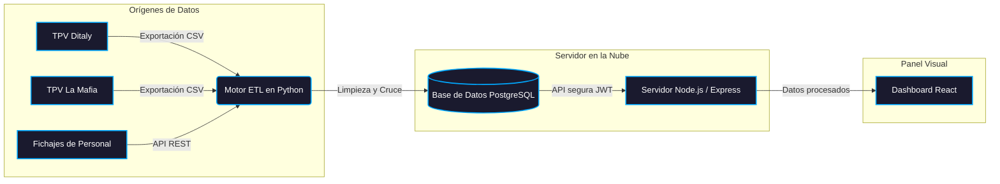
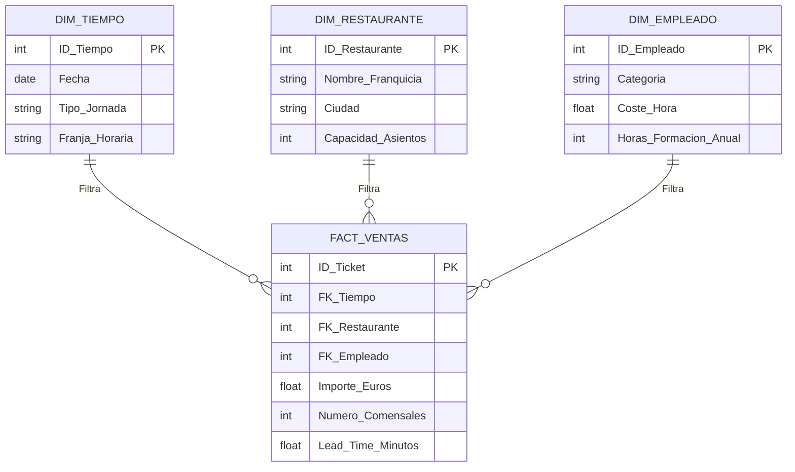

# 6. Implementación Técnica del Sistema y Plan de Despliegue

Este capítulo documenta cómo se ha llevado a cabo la construcción del sistema de información que materializa el Cuadro de Mando Integral diseñado en el capítulo anterior. Se describe la metodología de desarrollo utilizada, la arquitectura técnica del sistema, las funcionalidades del panel de control resultante y, por último, el plan de implantación progresiva en los locales de Claunafood S.L.

Uno de los aspectos más relevantes de este proyecto, desde el punto de vista de la gestión, es la metodología con la que se ha construido el software. Desarrollar un sistema de Business Intelligence completo (con base de datos, servidor y panel visual interactivo) siendo el único autor y sin perfil de ingeniero informático habría resultado inviable hasta hace muy poco tiempo. En este trabajo se ha aplicado lo que en el entorno tecnológico se denomina "Vibe Coding": un paradigma de desarrollo asistido por Inteligencia Artificial Generativa.

El "Vibe Coding" no consiste en que la máquina programe sola. Consiste en que el rol del desarrollador se desplaza: en lugar de escribir código línea a línea, el alumno actúa como arquitecto y director del proyecto. Define las reglas de negocio en lenguaje natural (qué tiene que calcular el sistema, cómo tiene que estructurarse la base de datos, qué tiene que mostrar cada pantalla) y delega la implementación técnica en herramientas de IA generativa que traducen esas instrucciones a código funcional.

Este enfoque tiene una implicación directa para un alumno de ADET: permite que el valor añadido esté en el diseño estratégico del sistema (qué medir, cómo estructurarlo, qué decisiones debe facilitar), que es exactamente la competencia de un graduado en dirección de empresas. El resultado es un sistema real, funcional y adaptado a las necesidades de Claunafood, construido con tecnologías de nivel profesional (React, Node.js, PostgreSQL) en el tiempo disponible de un TFG.

## 6.2 Arquitectura técnica del sistema

El sistema se compone de tres capas diferenciadas que trabajan de forma integrada:



Figura 6.1. Arquitectura del sistema de datos de Claunafood S.L. Fuente: Elaboración propia.

- Capa de extracción y transformación (ETL): Un script en Python que recoge los datos brutos de los TPV de cada restaurante, los limpia y los carga en la base de datos centralizada.
- Capa de almacenamiento y servidor (PostgreSQL + Node.js): La base de datos relacional donde se guardan todos los registros históricos, y el servidor que gestiona las peticiones del panel visual con autenticación segura.
- Capa de visualización (React): El panel web interactivo donde los encargados y la dirección consultan los KPIs en tiempo real.

## 6.3 El proceso de integración de datos (ETL)

Para que el panel muestre datos reales y actualizados, es necesario un proceso automático que recoja la información de los TPV cada noche, la procese y la almacene de forma estructurada. Este proceso se denomina ETL (Extracción, Transformación y Carga) y se ha implementado en Python.

El script se orquesta para ejecutarse automáticamente tras el cierre de caja, de forma que la dirección disponga de los datos actualizados a primera hora de la mañana siguiente. Las transformaciones más relevantes que aplica son:

```python
# Módulo ETL: transformación de datos del TPV para el cálculo de Prime Cost y Lead Time
import pandas as pd

def procesar_cierre_caja(archivo_tpv_csv, archivo_nominas):
    # 1. Extracción: lectura de los datos brutos del sistema de caja
    df_ventas = pd.read_csv(archivo_tpv_csv, sep=';')
    df_costes_laborales = pd.read_csv(archivo_nominas)

    # 2. Transformación: limpieza y cálculo de métricas operativas
    # Se eliminan los tickets anulados para no distorsionar los cálculos
    df_ventas = df_ventas[df_ventas['Estado_Ticket'] != 'Cancelado']

    # Cálculo del Lead Time: tiempo en minutos entre apertura y cierre de mesa
    df_ventas['Hora_Apertura'] = pd.to_datetime(df_ventas['Hora_Apertura'])
    df_ventas['Hora_Cierre'] = pd.to_datetime(df_ventas['Hora_Cierre'])
    df_ventas['Minutos_Estancia'] = (
        df_ventas['Hora_Cierre'] - df_ventas['Hora_Apertura']
    ).dt.total_seconds() / 60

    # 3. Carga: cruce con los datos de nómina para calcular el Prime Cost
    df_consolidado = pd.merge(df_ventas, df_costes_laborales, on='ID_Empleado', how='left')

    return df_consolidado
```

Figura 6.2. Extracto del módulo ETL desarrollado para la automatización de la captura de datos.

## 6.4 Estructura de almacenamiento: el modelo en estrella

Para que el panel pueda consultar meses de datos históricos de forma rápida, la base de datos se ha diseñado siguiendo el modelo en estrella (Star Schema), un estándar de Business Intelligence que separa los datos de rendimiento (ventas, tiempos, costes) del contexto estructural (qué restaurante, en qué fecha, con qué empleado).



Figura 6.3. Modelo en estrella de la base de datos de Claunafood S.L. Fuente: Elaboración propia.

Esta estructura permite calcular el RevPASH en tiempo real cruzando los datos de ventas con la capacidad del restaurante y el horario de apertura, sin necesidad de recorrer toda la tabla de registros históricos cada vez.

## 6.5 El panel de control: descripción y funcionamiento

El resultado final del sistema es un panel web interactivo accesible desde cualquier dispositivo con conexión a internet. A continuación se documentan las pantallas principales y su función dentro del CMI de Claunafood.

### 6.5.1 Acceso y control de perfiles

El sistema dispone de autenticación con dos niveles de acceso diferenciados, tal como se diseñó en el apartado 5.6:

Figura 6.4. Pantalla de acceso al sistema CMI de Claunafood. Fuente: Elaboración propia.

- Acceso como Administrador (Dirección General): visión consolidada de todos los locales.
- Acceso como Encargado de local (Ditaly (Salamanca) / La Mafia (Zamora)): visión filtrada únicamente para su restaurante, sin acceso a los datos financieros globales de la empresa.

### 6.5.2 Dashboard principal: monitorización estratégica

Una vez autenticado, el panel muestra en tiempo real los KPIs críticos de cada local organizados por perspectivas. Cada tarjeta de indicador incluye el valor actual, la tendencia respecto al período anterior y una barra de progreso hacia el objetivo marcado. Si un KPI supera el umbral crítico, el sistema activa una señal de alerta visual.

Figura 6.5. Dashboard principal del CMI con los KPIs del restaurante Ditaly (Salamanca). Fuente: Elaboración propia.

La barra lateral izquierda permite alternar entre la vista consolidada de toda la empresa y la vista individualizada por local (Ditaly (Salamanca), La Mafia (Zamora), LaRuqa (Siglo XXI - Zamora)), facilitando el benchmarking interno entre restaurantes.

Figura 6.6. Vista del dashboard filtrada para el restaurante LaRuqa (Siglo XXI - Zamora). Fuente: Elaboración propia.

### 6.5.3 Gestión interactiva de acciones correctivas y asignación de OKRs por roles

El Cuadro de Mando Integral implementado no es una herramienta puramente contemplativa de reporte pasivo; está diseñado para ser un motor dinámico de asignación y ejecución operativa de planes de choque. Para cumplir con esta premisa, se ha integrado un módulo de **Gestión de Tareas y OKRs Correctivos** en el panel lateral que funciona bajo un modelo asimétrico de roles de seguridad (RBAC) y control de flujo de trabajo:

*   **Asignación Directiva (Enfoque Top-Down):** Solo el perfil de **Director General (administrador)** posee los permisos de escritura a nivel de API (`POST /tasks`) y visibilidad de interfaz para inyectar nuevas tareas correctivas y OKRs directamente desde el dashboard. Esto le permite definir la dirección estratégica y formular planes inmediatos ante desviaciones críticas (como el descuadre del *Prime Cost*).
*   **Ejecución Operativa (Enfoque Bottom-Up):** Los **Encargados de local (usuarios)** tienen una vista estrictamente de consulta respecto a la creación de tareas (el formulario de inserción está oculto en su interfaz para evitar ruido o desviaciones de la dirección general). No obstante, son ellos quienes deben ejecutar los planes. 
*   **Micro-interacción de Ciclo de Estado Dinámico (Acción Directa):** Para cerrar el bucle de control de manera ágil y sin fricciones burocráticas, ambos roles pueden interactuar directamente con la interfaz haciendo clic en la insignia o *badge* de estado de cualquier tarea activa (`todo` / `in-progress` / `done`). Al hacer clic, el estado de la tarea en la base de datos se actualiza cíclicamente en tiempo real mediante peticiones `PUT`:
    *   🔴 **Pendiente (`todo`):** Estado inicial asignado por la Dirección General al detectar la anomalía.
    *   🟡 **En curso (`in-progress`):** Marcado por el Encargado de local cuando se inicia la acción correctiva (ej. *"Revisar escandallos de pizzas premium"*).
    *   🟢 **Completado (`done`):** Marcado al solventarse el problema operativo, sirviendo de reporte de finalización automático para la gerencia.

Figura 6.7. Módulo de asignación de tareas correctivas (OKR) integrado en el CMI. Fuente: Elaboración propia.

### 6.5.4 Módulo de análisis estratégico por Inteligencia Artificial (Grok AI / OpenClaw)

El sistema incorpora un módulo avanzado de análisis automático basado en Inteligencia Artificial Generativa, denominado OpenClaw en la interfaz de la aplicación. Su función es interpretar el conjunto de KPIs activos en el panel y generar en tiempo real un diagnóstico estratégico con dos componentes: una detección de anomalías y una recomendación de acción concreta.

El módulo funciona de la siguiente forma: cuando el usuario pulsa el botón "Generar Insight Estratégico", el sistema recoge los valores actuales de todos los KPIs visibles en el panel — incluyendo sus tendencias históricas y el porcentaje de cumplimiento respecto al target — y los envía a la red de inferencia Groq, que los procesa mediante el modelo de lenguaje LLaMA-3. El sistema devuelve un análisis en lenguaje natural que el encargado o el director puede leer directamente, sin necesidad de interpretar los datos por sí mismo.

La decisión de integrar este módulo responde a una necesidad real detectada durante el análisis de Claunafood: los encargados de turno no tienen perfil analítico, por lo que un panel con diez indicadores numéricos puede resultar difícil de interpretar bajo la presión del servicio. El módulo de IA actúa como un segundo nivel de lectura: si los datos del panel no son suficientes para tomar una decisión inmediata, el sistema puede generar una interpretación automática que oriente la acción del equipo.

Este módulo es una extensión del paradigma "Vibe Coding" descrito en el apartado 6.1: igual que el desarrollo del software se apoyó en IA para traducir reglas de negocio a código, el uso del sistema en el día a día también integra IA como herramienta de interpretación estratégica, sin reemplazar al director, sino apoyando su toma de decisiones con análisis instantáneo.

### 6.5.5 Módulo de introducción manual de registros (Carga de datos no automatizados)

Aunque el motor ETL en Python automatiza la captura del 80% de los datos transaccionales, existen métricas de naturaleza cualitativa o de gestión blanda (como el eNPS de clima laboral, el Índice de Formación o la Tasa de Incidencias cuando no se integra con soporte digital) que requieren de alimentación humana periódica.

Para resolver esta limitación de entrada, la interfaz del panel web dispone de un formulario de inserción directa dentro de la vista detallada de cada indicador (`KpiDetail.js`). El flujo de operación es el siguiente:
1. **Selección del KPI:** El usuario hace clic sobre la tarjeta del indicador que desea actualizar desde el panel principal.
2. **Formulario de Carga:** Debajo de la gráfica de evolución histórica, el sistema habilita un formulario simplificado con dos campos obligatorios: **Valor** (el dato numérico obtenido, ej. `72` para NPS o `95` para formación) y **Fecha de Registro** (con formato estandarizado `AAAA-MM-DD`).
3. **Actualización del histórico:** Al pulsar el botón "Add entry", el cliente web realiza una petición segura `POST /kpi-entries` al servidor backend, almacenando la nueva tupla y refrescando la gráfica de manera inmediata sin necesidad de recargar la página.

## 6.6 Plan de implantación en Claunafood S.L.

El despliegue del sistema en los tres locales de Claunafood se ha planificado en cuatro fases progresivas para minimizar la disrupción operativa y permitir que el equipo se adapte gradualmente a la herramienta.

Tabla 6.1. Plan de implantación del CMI por fases.

| Fase | Alcance | Actividades principales | Duración estimada |
| :--- | :--- | :--- | :--- |
| Fase 1: Instalación | Servidor y base de datos | Despliegue del servidor en la nube. Configuración de la base de datos PostgreSQL. Carga de datos históricos de 2024. | 2 semanas |
| Fase 2: Conexión de datos | TPV → ETL → Base de datos | Configuración del script ETL para la exportación automática nocturna desde los TPV de Ditaly (Salamanca) y La Mafia (Zamora). Validación de los primeros datos cargados. | 2 semanas |
| Fase 3: Formación | Dirección y encargados | Sesión de formación con la gerencia de Claunafood (vista de administrador). Sesión específica con los encargados de Ditaly (Salamanca) y La Mafia (Zamora) (vista de local). | 1 semana |
| Fase 4: Operación y revisión | Todos los locales | Incorporación de LaRuqa (Siglo XXI - Zamora) al sistema. Revisión del primer mes de datos reales. Ajuste de targets si los datos históricos revelan que algún objetivo era poco realista. | 1 mes |

*Fuente: Elaboración propia.*

El objetivo de esta implantación escalonada es que, al finalizar la Fase 4, la dirección de Claunafood disponga de un sistema operativo que sustituya por completo los cierres contables mensuales tardíos por una monitorización continua y automatizada de los KPIs críticos de los tres locales.

## 6.7 Integración de KPIs en el sistema: catálogo dinámico

Uno de los problemas habituales en los sistemas de Business Intelligence es la rigidez: una vez programado el panel, añadir un nuevo indicador implica modificar el código. Para evitar este problema, el sistema desarrollado implementa un catálogo dinámico de KPIs que permite añadir, modificar o desactivar indicadores directamente desde la interfaz de usuario sin intervención técnica.

El funcionamiento es el siguiente: los KPIs diseñados en el Capítulo 4 se dividen en dos grupos según su estado de activación en el sistema:

- KPIs pre-cargados: Los indicadores que forman el núcleo del CMI (EBITDA Margin, Prime Cost (F&B + Labor), RevPASH, NPS Global, % Ventas Delivery, Rotación de Mesas y Lead Time de Cocina) están activos desde el primer día en el panel de cada restaurante. El sistema los calcula y actualiza automáticamente a partir de los datos que recibe del ETL.

- KPIs disponibles vía catálogo: El resto de indicadores del catálogo (eNPS, Índice de Formación, Desviación del Escandallo y Tasa de Incidencias) están definidos en la base de datos pero no aparecen por defecto en el panel. El encargado o el administrador puede activarlos desde el botón "Catálogo KPIs" de la barra superior, seleccionarlo y añadirlo al panel con un solo clic.

Esta arquitectura tiene dos ventajas directas para Claunafood. En primer lugar, permite que el panel de los encargados no esté saturado de datos desde el primer día (aparecen solo los indicadores más críticos, y el equipo puede ir incorporando más métricas conforme se familiariza con el sistema). En segundo lugar, hace que el sistema sea ampliable: si en el futuro la dirección decide monitorizar un nuevo indicador (por ejemplo, el consumo energético por servicio o la tasa de conversión de la app de delivery), solo es necesario crearlo en la base de datos y asignarlo a los restaurantes correspondientes, sin tocar el código de la aplicación.

